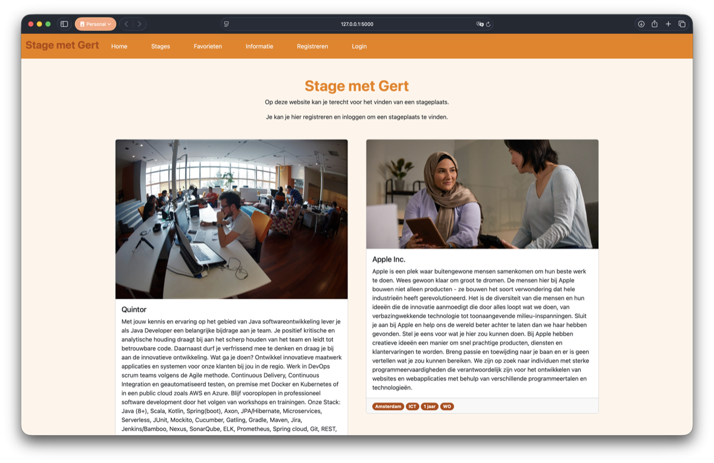
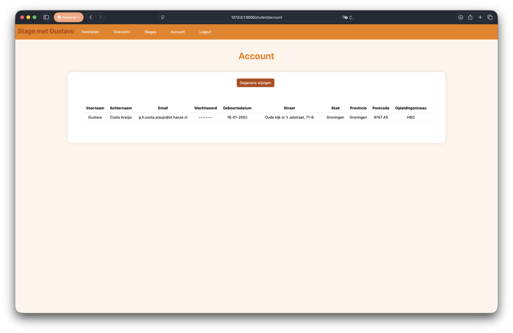
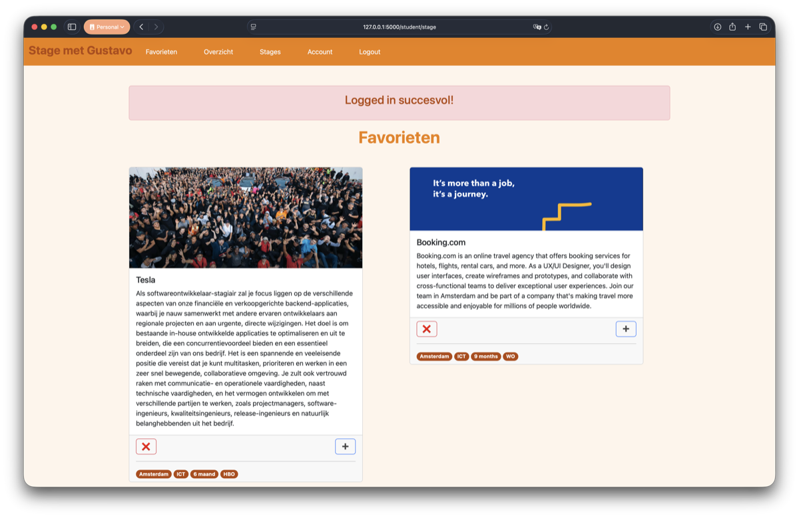
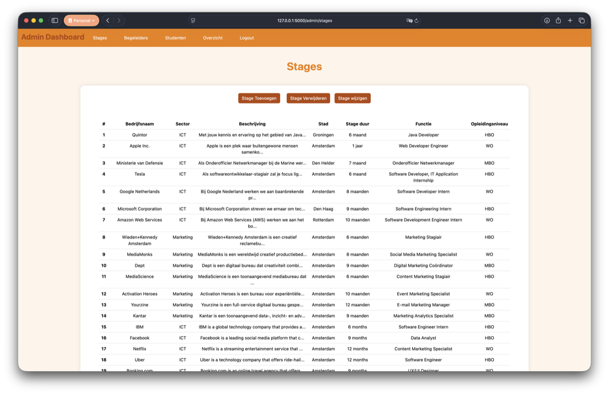
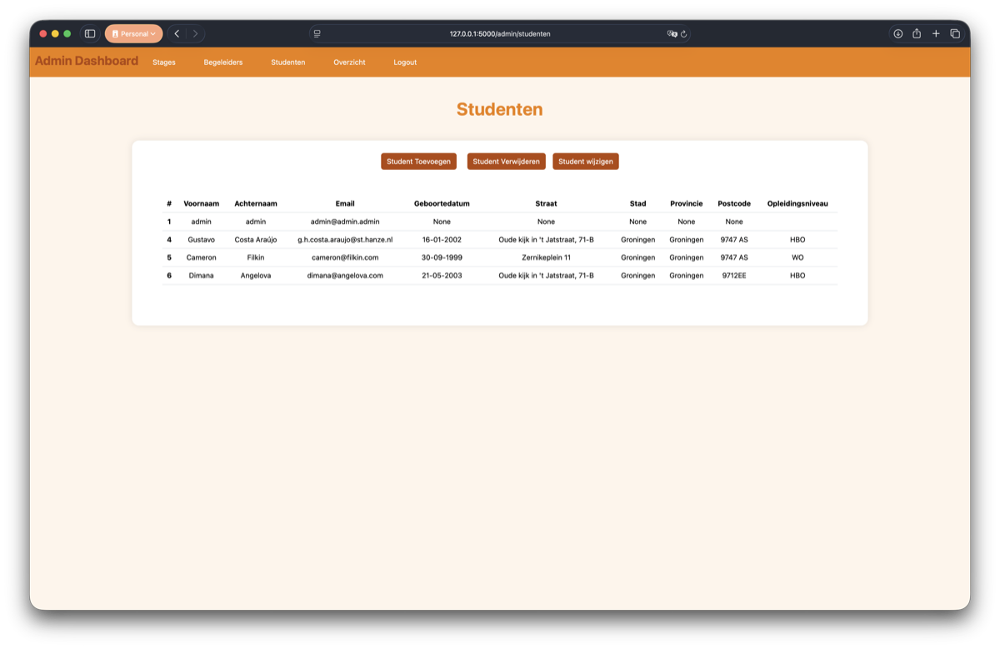
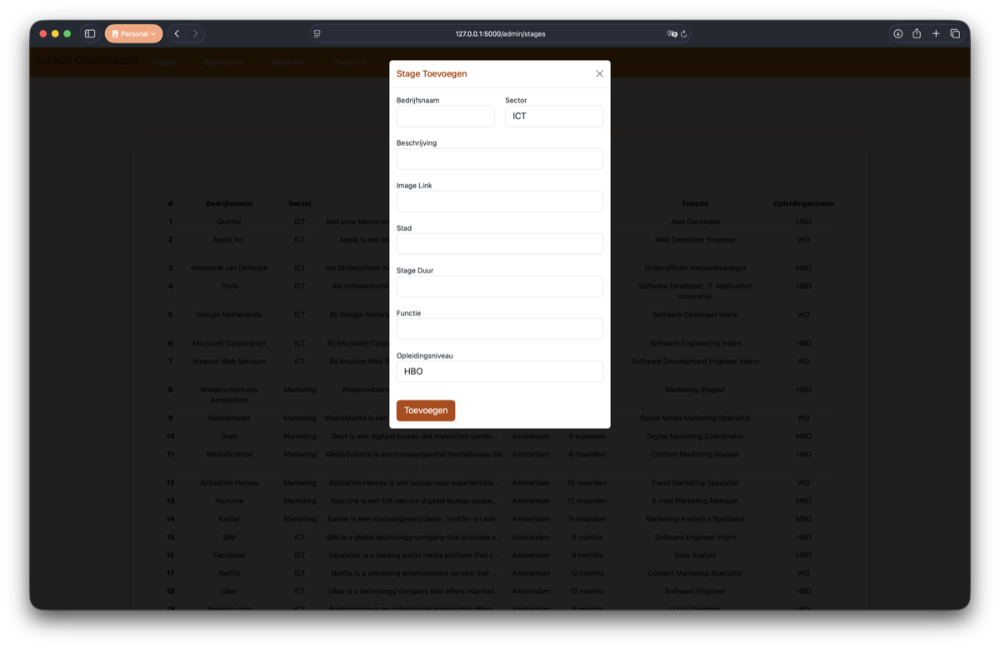

# StageMetGert - Internship Management System

**StageMetGert** is a first-year (*Propedeuse*) student project developed for the HBO-ICT Web Technology course. It is a comprehensive web platform designed to streamline the internship management process for both students and educational administrators. Built with Flask and SQLite, it offers a robust system for browsing, favoriting, and applying for internships, while providing administrators with powerful tools to oversee the entire lifecycle.

## 🚀 Key Features

### For Students
- **Internship Discovery:** Browse through a curated list of internships across various sectors like ICT and Marketing.
- **Favorites System:** Save internships of interest to a personal favorites list (available for both guest users via cookies and registered students via the database).
- **Application Management:** Apply for internships and track your status.
- **Personal Dashboard:** Manage your profile, view favorited internships, and see your current internship details including supervisor and assigned grade.
- **Secure Authentication:** User registration and login with hashed password protection.

### For Administrators
- **Comprehensive Overview:** A central dashboard to monitor all active internships, assigned students, and supervisors.
- **Supervisor Management:** Add, update, or remove internship supervisors and assign them to specific departments.
- **Internship Catalog Management:** Fully manage the list of available internships (Create, Read, Update, Delete).
- **Student Oversight:** Manage student accounts and their internship assignments.
- **Grading System:** Assign and update grades for students upon completion of their internships.

---

## 🛠 Tech Stack

- **Backend:** Python 3.13+, Flask
- **Database:** SQLite with SQLAlchemy ORM
- **Migrations:** Flask-Migrate (Alembic)
- **Forms & Validation:** Flask-WTF, WTForms
- **Authentication:** Flask-Login
- **Frontend:** Jinja2 Templates, Custom CSS (with Bootstrap overrides)
- **Styling:** Modern UI with a dedicated color palette (`#EE7F00` primary, `#B44708` secondary)

---

## 📂 Project Structure

```text
├── app.py                # Main entry point and route definitions
├── config.py             # Application and database configuration
├── Project/              # Main application package
│   ├── __init__.py       # App factory and extension initialization
│   ├── models.py         # Database schema definitions
│   ├── forms.py          # WTForms for all user and admin interactions
│   ├── static/           # Static assets (CSS, Images)
│   └── templates/        # Jinja2 HTML templates
└── StageMetGert.db       # SQLite Database file
```

---

## ⚙️ Installation & Setup

Follow these steps to get the project running locally:

### 1. Clone the Repository
```bash
git clone https://github.com/coolstavo/StageMetGert.git
cd StageMetGert
```

### 2. Prerequisites
Ensure you have **Python 3.13** (or a recent 3.x version) installed on your system.

### 3. Create a Virtual Environment
It is recommended to use a virtual environment to manage dependencies.
```bash
# Create venv
python -m venv venv

# Activate venv (macOS/Linux)
source venv/bin/activate

# Activate venv (Windows)
venv\Scripts\activate
```

### 4. Install Dependencies
Install the required Python packages:
```bash
pip install Flask Flask-SQLAlchemy Flask-Migrate Flask-Login Flask-WTF email-validator
```

### 5. Run the Application
Start the Flask development server:
```bash
python app.py
```
The application will be available at `http://127.0.0.1:5000/`.

---

## 📖 Usage

### Administrative Access
For testing the administrative features, you can log in with the following default credentials:
- **Email:** `admin@admin.admin`
- **Password:** `admin`

### Student Access
To explore the platform as a student, please **register a new account** via the "Registreren" page. This will allow you to:
- Favorite internships.
- Apply for available positions.
- Manage your personal profile and view your internship status.

---

## 📱 Screenshots

### 🎓 Student Album

**Home**
<br>

<br><br>

**Account**
<br>

<br><br>

**Favorites**
<br>

<br><br>

### 🛡️ Admin Album

**Internships**
<br>

<br><br>

**Students**
<br>

<br><br>

**Add Internship**
<br>


---

## 📝 License

This project was developed for educational purposes as part of the Year 1 (Propedeuse) HBO-ICT Web Technology course.
